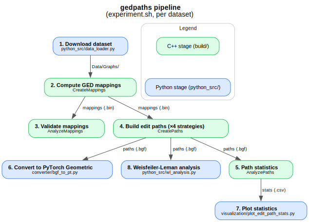

# GEDPaths
Repo that builds up on [libGraph](https://github.com/mlai-bonn/libGraph) and uses [gedlib](https://github.com/dbblumenthal/gedlib) to create edit paths between two pairs of graphs from different sources.

## Installation
See [INSTALLATION.md](INSTALLATION.md) for all dependencies and detailed setup instructions.

## Repository layout

- `Data/` — input data: `Graphs/` (raw TU datasets, downloaded by `python_src/data_loader.py`), `ProcessedGraphs/` (preprocessed binaries), `RawTargets/` (cache for PyG/OGB targets used by `python_src/precomputed_targets.py`)
- `Results/` — all pipeline outputs: `Mappings/<METHOD>/<DB>/` and `Paths_<STRATEGY>/<METHOD>/<DB>/`
- `src/` — C++ implementations (header-only); the `.cpp` entry points live at the repo root
- `python_src/` — data loading, conversion to PyTorch Geometric, visualization, and WL analysis
- `specs/`, `issues/`, `analysis/` — planning notes, archived issue logs, and analysis reports
- `_archive/` — parked legacy data folders (old experiment outputs and stray download caches); not used by any code and not committed


## Run experiments

Use the provided experiment.sh script to run all experiments:
```bash
chmod u+x experiment.sh
./experiment.sh -db MUTAG
```

**Options:**
- `-db <names>`: One or more datasets, comma-separated (e.g., `-db MUTAG,NCI1`); default MUTAG
- `-method <method>`: GED method (default F2)
- `-recompile [threads]`: Rebuild the C++ executables before running
- `-only_evaluation`: Skip the mapping/path computation, only run analysis and Python stages
- `-only_python`: Skip all C++ steps, only run the Python stages
- `-env <path>`: Path to the Python virtual environment (default `venv`)

### Pipeline



For each dataset, `experiment.sh` runs the following stages; each stage reads the output of the previous one:

| # | Stage | Command | Reads | Writes |
|---|-------|---------|-------|--------|
| 1 | Download dataset | `python_src/data_loader.py -db <DB>` | TU Dortmund website | `Data/Graphs/<DB>/` |
| 2 | Compute GED mappings | `build/CreateMappings -db <DB> -num_pairs 5000 -method <METHOD> -t 30 -method_options time-limit 180` | `Data/Graphs/`, `Data/ProcessedGraphs/` | `Results/Mappings/<METHOD>/<DB>/` |
| 3 | Validate mappings | `build/AnalyzeMappings -db <DB> -method <METHOD>` | `Results/Mappings/...` | `Results/Mappings/.../Evaluation/` |
| 4 | Build edit paths (×4 strategies) | `build/CreatePaths -db <DB> -method <METHOD> -path_strategy <...>` | `Data/ProcessedGraphs/`, `Results/Mappings/...` | `Results/Paths_<STRATEGY>/<METHOD>/<DB>/` |
| 5 | Path statistics (×4) | `build/AnalyzePaths -db <DB> -method <METHOD> -path_strategy <STRATEGY>` | `Results/Paths_.../*.bgf` | `Results/Paths_.../Evaluation/*.csv` |
| 6 | Convert to PyTorch Geometric (×4) | `python_src/converter/bgf_to_pt.py` | `Results/Paths_.../*.bgf` | `Results/Paths_.../processed/data.pt` |
| 7 | Plot statistics (×4) | `python_src/visualization/plot_edit_path_stats.py` | `Results/Paths_.../Evaluation/*.csv` | `Results/Paths_.../Evaluation_Python/` (plots, tables) |
| 8 | Weisfeiler-Leman analysis (×4) | `python_src/wl_analysis.py` | `Results/Paths_.../*.bgf` | `Results/Paths_.../WLAnalysis/` |

The four path strategies are `Rnd` (random order), `Rnd_d-IsoN` (random + delete isolated nodes), `i-E_d-IsoN` (insert edges first), and `d-E_d-IsoN` (delete edges first); each gets its own `Results/Paths_<STRATEGY>/` tree. Stages 2 and 4 are skipped with `-only_evaluation`; all C++ stages (2–5) are skipped with `-only_python`.

### Pipeline steps in detail

Each step below explains *what the stage does* and how it feeds the next one. Stages 4–8 run once per path strategy (four times by default).

1. **Download dataset** — `python_src/data_loader.py -db <DB>`
   Fetches the named [TU Dortmund](https://chrsmrrs.github.io/datasets/) graph dataset and unpacks it into `Data/Graphs/<DB>/`. This is the only step that touches the network; everything afterwards is local. You can skip it by dropping your own graphs (in the same format) into `Data/Graphs/`.

2. **Compute GED mappings** — `build/CreateMappings`
   Samples random pairs of graphs from the dataset and, for each pair, solves the **graph edit distance** with the chosen method (e.g. `F2`, an exact MIP solved via GUROBI). The result of each solve is a *node-to-node edit mapping* describing how to transform one graph into the other (substitutions, insertions, deletions). Writes `<DB>_ged_mapping.{bin,csv}` plus `graph_ids.txt` (the sampled pairs) under `Results/Mappings/<METHOD>/<DB>/`.

3. **Validate mappings** — `build/AnalyzeMappings`
   Sanity-checks the mappings from step 2 (each mapping must be a valid edit operation set) and emits aggregate statistics under `Results/Mappings/<METHOD>/<DB>/Evaluation/`. Catches solver failures or malformed mappings before they propagate downstream.

4. **Build edit paths** — `build/CreatePaths`
   Turns each node mapping into an **edit path**: an ordered sequence of intermediate graphs that morph the source graph into the target, one edit at a time. The `-path_strategy` controls the order of operations (`Rnd`, `Rnd_d-IsoN`, `i-E_d-IsoN`, `d-E_d-IsoN`). Writes `<DB>_edit_paths.{bin,bgf,csv}` under `Results/Paths_<STRATEGY>/<METHOD>/<DB>/`; the `.bgf` is the binary graph format the Python converter reads.

5. **Path statistics** — `build/AnalyzePaths`
   Computes per-strategy statistics over the generated path graphs (path lengths, graph sizes, edit-operation counts, …) and writes CSV summaries under `Results/Paths_<STRATEGY>/.../Evaluation/`.

6. **Convert to PyTorch Geometric** — `python_src/converter/bgf_to_pt.py`
   Reads the `.bgf` path graphs and builds a PyTorch Geometric in-memory dataset (`BGFInMemoryDataset`), serialized to `Results/Paths_<STRATEGY>/.../processed/data.pt`. This is the artifact consumed by the GNN experiments.

7. **Plot statistics** — `python_src/visualization/plot_edit_path_stats.py`
   Renders the step-5 CSVs into plots and summary tables under `Results/Paths_<STRATEGY>/.../Evaluation_Python/` for quick visual inspection.

8. **Weisfeiler-Leman analysis** — `python_src/wl_analysis.py`
   Runs the Weisfeiler-Leman algorithm over the path graphs (a measure of GNN-distinguishability) and writes results under `Results/Paths_<STRATEGY>/.../WLAnalysis/`.

> The diagram source lives at [`docs/pipeline.dot`](docs/pipeline.dot); regenerate the image with `dot -Tsvg docs/pipeline.dot -o docs/pipeline.svg`.

## Usage


### 1. Compute Mappings
- **Download a dataset** from [TUDortmund](https://chrsmrrs.github.io/datasets/) or use your own graphs in the same format in the `Data/Graphs/` folder.

#### Build the project
```bash
mkdir build
cd build
cmake ..
make -j 6
```

#### Run the mapping computation
```bash
./CreateMappings \
  -db MUTAG \
  -raw ../Data/Graphs/ \
  -processed ../Data/ProcessedGraphs/ \
  -mappings ../Results/Mappings/ \
  -t 30 \
  -method F2 \
  -cost CONSTANT \
  -seed 42 \
  -num_pairs 5000
```


**Main arguments:**
  - `-db <database name>`: Name of the dataset (e.g., MUTAG)
  - `-raw <raw data path>`: Path to raw graph data
  - `-processed <processed data path>`: Path to store processed graphs
  - `-mappings <output path>`: Path to store mappings (now in `Results/Mappings/`)
  - `-t <threads>`: Number of threads used to process graph pairs in parallel
  - `-method <method>`: GED method (e.g., REFINE, F2)
  - `-method_options <opts>`: Options forwarded to the GED method, e.g. `time-limit 180` or `threads 8` (solver-internal threads, e.g. for GUROBI — independent of `-t`)
  - `-cost <cost>`: Edit cost type (e.g., CONSTANT)
  - `-seed <seed>`: Random seed
  - `-num_pairs <N>`: Number of graph pairs (optional)

**Output files:**
- After running, you will find the following files in `../Results/Mappings/<METHOD>/<DB>/`:
    - `<DB>_ged_mapping.bin`: Binary file containing the computed graph edit distance mappings (used for further processing).
    - `<DB>_ged_mapping.csv`: CSV file with meta information in a human-readable format (for inspection, analysis, or use in other tools).
    - `graph_ids.txt`: The list of graph pairs for which mappings were computed.


### 2. Compute Edit Paths

#### Build the project (if not already built)
```bash
mkdir build
cd build
cmake ..
make -j 6
```

#### Run the edit path computation
```bash
./CreatePaths \
  -db MUTAG \
  -processed ../Data/ProcessedGraphs/ \
  -mappings ../Results/Mappings/REFINE/MUTAG/ \
  -num_mappings 1000 \
  -path_strategy Random DeleteIsolatedNodes
```

**Output files:**
- After running, you will find the following files in `../Results/Paths_<STRATEGY>/<METHOD>/<DB>/`, where `<STRATEGY>` is the shorthand for the chosen path strategy (`Rnd`, `Rnd_d-IsoN`, `i-E_d-IsoN`, `d-E_d-IsoN`):
    - `<DB>_edit_paths.bin`: Binary file containing the computed edit paths (used for further processing).
    - `<DB>_edit_paths.bgf`: Binary graph file read by the Python converter.
    - `<DB>_edit_paths.csv`: CSV file with edit path information in a human-readable format (for inspection, analysis, or use in other tools).

**Main arguments:**
  - `-db <database name>`: Name of the dataset
  - `-processed <processed data path>`: Path to processed graphs
  - `-mappings <mappings path>`: Path to mappings (now in `Results/Mappings/REFINE/<DB>/`)
  - `-path_strategy <strategy...>`: Composable strategy: `Random`, `InsertEdges` or `DeleteEdges`, optionally followed by `DeleteIsolatedNodes`

### 3. Export to PyTorch Geometric Format

Convert the `.bgf` path graphs from step 2 into a PyTorch Geometric in-memory dataset:

```bash
python python_src/converter/bgf_to_pt.py \
  --db MUTAG \
  --method F2 \
  --path_strategy Rnd
```

**Main arguments:**
  - `--db <database name>`: Name of the dataset
  - `--method <method>`: GED method whose paths to convert (e.g. F2)
  - `--path_strategy <strategy>`: Strategy shorthand (`Rnd`, `Rnd_d-IsoN`, `i-E_d-IsoN`, `d-E_d-IsoN`)

**Output:** a serialized PyG dataset at `Results/Paths_<STRATEGY>/<METHOD>/<DB>/processed/data.pt`, backed by `BGFInMemoryDataset` (see `python_src/converter/bgf_to_torch_geometric.py`). Run the script from the repo root, or ensure the repo root is on `PYTHONPATH` (`experiment.sh` exports it automatically).

---

## For the exact solvers (e.g., F1, F2)
You need GUROBI 12.0.3 installed and properly configured. See [GUROBI 12.0.3 Installation](INSTALLATION.md#install-gurobi-1203-linux).

---
